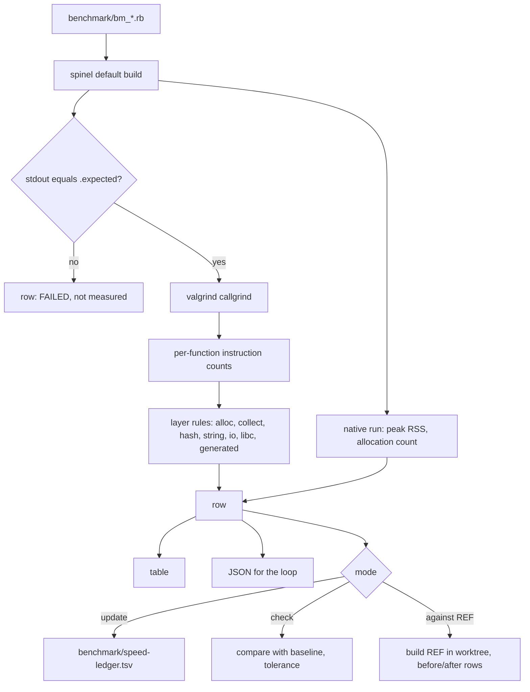
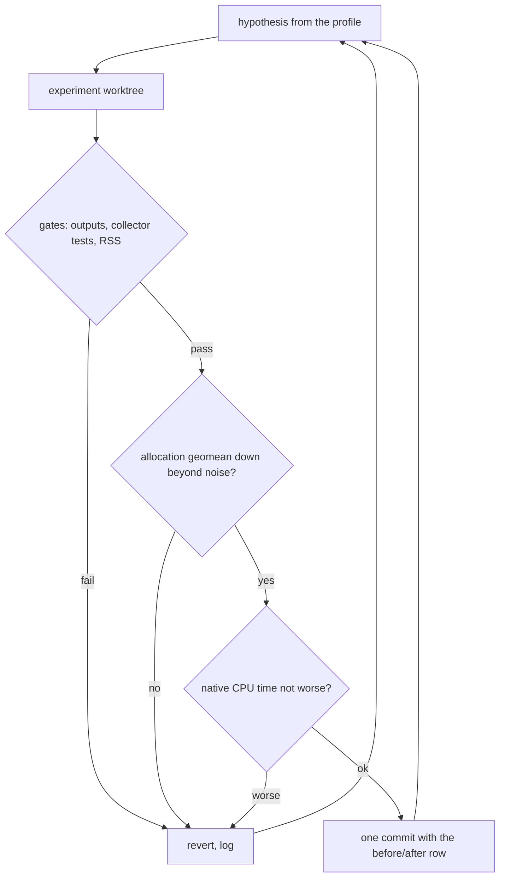

# Speed Ledger and Allocation Loop - Plan

## Goal Capsule

- **Objective:** Anyone changing Spinel can state what the change costs or saves on the README's narrow benchmarks with one reproducible command, and the allocation-bound benchmarks (the allocation set of KTD7) run measurably fewer instructions than upstream master does today.
- **Means:** an instruction-count ledger under `tools/` (KTD1, KTD2), used as the scoring harness of a ce-optimize keep/revert loop on allocation cost (KTD6, KTD7).
- **Authority:** the user's four settled decisions (the two Key Decisions, KTD9 and KTD10) outrank this plan; the Product Contract outranks the Planning Contract; units override neither.
- **Execution profile:** U1 to U4 are ordinary tool work. U5 is a long measured loop with its own stopping rules.
- **Stop conditions:** stop and report if upstream lands a benchmark ledger or allocator speed work while this runs, if a kept change cannot pass the correctness gates in the Verification Contract, or if instruction counts stop repeating run to run.
- **Who finishes:** work ends pushed to `claude/alloc-speed-loop-h0j89v` on the fork. The user decides what becomes an upstream pull request.

---

## Product Contract

### Summary

Add `tools/speed_ledger.rb`, a baseline file and a `make` target that record instruction counts per benchmark, split by runtime layer, and compare two builds.
Then run a measured keep/revert loop, scored by that ledger, on the allocation path that dominates `gcbench` and `binary_trees`.

### Problem Frame

Speed is Spinel's public claim, and nothing in the repository measures it.
`make bench` compares each benchmark's stdout with CRuby's and records no time.
The README table was measured once, on 2026-09-17, by hand with `perf stat`, and no script reproduces it.
Upstream merged 108 commits in the hours this branch was being set up, most of them correctness fixes in hot paths, with nothing watching their cost.

The README names its own weak cells: `io_wordcount`, `csv_process` and `gcbench`.
A callgrind profile of `gcbench` on upstream `0f6feeb9` shows where the allocation cells spend: 3,529,278,094 instructions for 15,333,862 `Node` allocations, about 230 per object.
`sp_gc_alloc` is 20.2% and the generated `sp_Node_new` is 31%.
By source line, the write barrier `sp_gc_wb` (`lib/sp_gc.h`) is 15.6% of all instructions and GC root push and pop are 11.7%.
Three of the barriers each constructor runs guard stores that cannot create an old-to-young reference: `@left = nil`, `@right = nil` and a static frozen literal.

matz rebuilt the allocator and collector between 11 and 17 September and has not changed their speed since.
`docs/internals/gc.md` records two abandoned nursery attempts and warns that speed changes near the barrier are easy to mis-measure.
That warning is the reason to settle the measurement before touching the code.

### Key Decisions

- **No pull request anywhere.** (session-settled: user-directed — chosen over lfg's usual open pull request: the user said "no prs yet") Governs R11.
- **Only unowned, hard work.** (session-settled: user-directed — chosen over line reading, CSV and typed-array speed, which Bart Leusink is on upstream: the user said "make sure nobody else work on it" and "pick hard problems") Governs R9.

### Requirements

**Ledger**

- R1. One command compiles each benchmark of a named set with the default `spinel` build, runs it under callgrind, and reports total instructions per benchmark.
- R2. Each row splits its total by layer: allocation, collection, hash, string, IO, libc and generated code.
- R3. A benchmark whose stdout differs from its `.expected` file is reported as failed and is not measured.
- R4. A committed baseline file holds one row per benchmark and the toolchain it was measured with.
- R5. A check mode compares a fresh run with the baseline and exits non-zero when any benchmark rose beyond a tolerance; on a different toolchain it reports the comparison as indicative and does not fail.
- R6. An A/B mode builds another git ref in a temporary worktree, measures both on this machine, and prints one before/after row per benchmark with the geometric mean.
- R7. A machine-readable output carries the same rows plus peak resident memory and allocation count per benchmark: the loop gates on the first and picks its scored benchmarks from the second.

**Loop**

- R8. The loop is scored on the geometric mean of instructions over the allocation set and keeps a change only when that mean falls beyond noise.
- R9. The loop leaves `io_wordcount` and `csv_process` line-reading and hash work to its upstream owner; they are guarded against regression, not optimized.
- R10. No kept change may alter any benchmark's output, fail the collector tests, or raise peak resident memory on the allocation benchmarks by more than 5%.
- R11. Work ends as commits pushed to `claude/alloc-speed-loop-h0j89v` on the fork, with no pull request.
- R12. Each kept change is its own commit, separate from ledger commits and from planning artifacts, and its message carries the before/after row.

### Success Criteria

- A second run of the ledger on an unchanged build reproduces every total within one part in a million.
- The geometric mean of instructions over the allocation set is lower at the end of the loop than at upstream `0f6feeb9`, with every gate in R10 green.
- Each kept change also shows no slowdown in native CPU time beyond the noise floor this machine measures between two copies of one build.

### Scope Boundaries

- Wall-clock comparison against Ruby 4.0 with YJIT is out: neither is installed here. The README table is not regenerated.
- A nursery or any moving collector is out: two attempts were abandoned upstream.
- The collector's policy defaults (thresholds, full interval, minor mark) are not changed by the loop. They trade memory for instructions, and the ledger cannot price memory.
- CI integration is not built. Callgrind runs 40 to 75 times slower than native, so the full table is a nightly-sized job; whether upstream wants it in CI is matz's call.
- Considered and not built: a per-line attribution mode. It needs `-g`, and the `--profile` build that provides it also adds frame pointers and changes the counts. Evidence that would change this: a loop decision that function-level shares cannot make.

#### Deferred to Follow-Up Work

- `json_parse` string indexing (53% of its instructions in three functions) is the next loop target after allocation.
- The boxed-operation count that `tools/doctor.rb` computes could ride along as a ledger column.

---

## Planning Contract

### Key Technical Decisions

- KTD1. **Instructions under callgrind, on the default build.** Counts repeat here to one part in two million and need no `perf`. The default build keeps its symbols, so callgrind names functions without `--profile`, which would add `-fno-omit-frame-pointer` and measure a different binary.
- KTD2. **A CRuby script in `tools/` with pure logic in a separate file.** `tools/compile_scale.rb` is the precedent for a measuring script driven from `make`. The parsing, bucketing and comparison live in `tools/speed_ledger_lib.rb`, written in the Spinel subset so a `test/tools_*.rb` test covers them the way `test/tools_diff_classify.rb` covers `tools/diff_classify.rb`.
- KTD3. **Baseline is a tab-separated text file at `benchmark/speed-ledger.tsv`.** One row per benchmark diffs cleanly in review. Header comment lines carry the toolchain fingerprint that check mode compares: compiler version, valgrind version and architecture. The spinel revision sits on its own header line as provenance and is never compared, since a baseline cannot name the commit that adds it.
- KTD4. **Layers come from function names and the object file callgrind reports.** One ordered rule table maps a function to a layer; a function in a shared library is libc; whatever matches no rule is generated code. Runtime helpers that the C compiler inlines into generated functions count as generated code, which the docs state.
- KTD5. **Two benchmark sets.** `narrow` is the eight rows below the README's geometric mean: `gcbench`, `binary_trees`, `json_parse`, `csv_process`, `io_wordcount`, `str_concat`, `splay`, `rbtree`. `all` is every `benchmark/bm_*.rb` whose emitted C does not use threads, since callgrind serializes them.
- KTD6. **The loop may change emitted code as well as the runtime.** The profile puts 27% of `gcbench` in barrier and root code the compiler emits, against 20% in `sp_gc_alloc`, which matz tuned last month. Mutable scope is `lib/sp_slab.c`, `lib/sp_alloc.c`, `lib/sp_gc.c`, `lib/sp_gc.h`, the allocation macros in `lib/spinel_rt.h`, and the constructor, barrier and root emission in `src/codegen*.c`.
- KTD7. **Primary metric is the geometric mean of instructions over the allocation set; everything else is a gate.** The allocation set is fixed before the first experiment as every benchmark in `all` that allocates at least one object per 1,000 instructions. Layer shares cannot define it, because KTD4 counts inlined barrier, root and constructor code as generated code. Gates on every experiment: outputs unchanged, no benchmark in `narrow` up more than 0.5%, peak resident memory per R10. Gate before a keep lands: no benchmark in `all` up more than 0.5% against the base.
- KTD8. **Native CPU time confirms a keep; it does not rank.** Before the first experiment the loop measures a noise floor per benchmark: the base build interleaved against itself, 20 runs an arm, five times, comparing medians of user plus system time. Only allocation-set benchmarks that run at least 100 ms natively take part. A candidate is reverted when its median is slower than base by more than twice the largest same-build gap seen. When that floor exceeds 5% the native result is recorded as inconclusive in the keep's commit message and does not revert. Two copies of one `gcbench` binary differed by up to 4.9% here while other jobs shared the machine, so a fixed threshold would decide by chance.
- KTD9. **The loop runs under ce-optimize.** (session-settled: user-directed — chosen over hand-tuned one-off changes: the user said "use ce-optimize to test them")
- KTD10. **Keeps land on the designated branch, not on `optimize/<spec>`.** (session-settled: user-directed — chosen over ce-optimize's own branch and its closing pull request: the user said "no prs yet" and the session may push only to `claude/alloc-speed-loop-h0j89v`) Experiments still run in separate worktrees.

### High-Level Technical Design

The loop treats the JSON output as its measurement and the gates as hard checks:

### Assumptions

These are unconfirmed bets made without the user present.

- The user's instruction to run the loop with ce-optimize covers its approval step, because every experiment is reversible, local, and capped by the limits in U5.
- Planning artifacts (`docs/plans/`, the exported loop log) may sit on the fork branch. They are kept in their own commits so an upstream pull request can leave them out.
- A 0.5% tolerance for check mode and a 0.2% keep threshold for the loop are far above the run-to-run spread of instruction counts and tight enough to catch a real change. Both are options, not constants.
- The system `ruby` (3.3.6) is acceptable for running the tool itself, as it is for `tools/compile_scale.rb`. The benchmark oracle stays the committed `.expected` files.

### Risks & Dependencies

- **Instruction counts miss cache and branch effects.** KTD8 is the mitigation; a keep still needs wall-clock confirmation against Ruby 4.0 with YJIT before the README can cite it.
- **Barrier and root changes are correctness-critical.** A missed barrier is a use-after-free that only a minor collection exposes, and the corpus in its default mode shows one only by luck. The Verification Contract's verifier rows are the mitigation: reduced-size copies of the benchmark shapes in `GC_MINOR_TESTS`, and a differential run of the whole corpus under the generational verifier before such a keep lands.
- **Upstream moves fast in `src/codegen*.c`.** Kept changes stay small and local so they rebase. U5 repeats the overlap scan before the first experiment and before each keep. Upstream added argument-temporary roots as correctness fixes on 2026-10-01 (#6549), so removing temporaries' roots is the hypothesis most likely to collide and is tried last.
- **matz may prefer to keep the collector to himself.** The ledger stands on its own if he does.
- **Depends on** valgrind 3.22 and gcc 13.3 as installed; the baseline's fingerprint records both.

### Sources & Research

- `tools/compile_scale.rb`, `tools/README.md` (the `compile_scale` section): the shape of a measuring script and its documentation.
- `tools/cdiff.sh`: builds a reference revision in a temporary worktree; the A/B mode follows it.
- `test/tools_diff_classify.rb`: how tool logic is tested inside the corpus.
- `Makefile` `bench` and `bench-compile` targets: naming and recipe style. A single corpus test runs through `make build/test-results/<name>.ok`; the recipe always exits zero and writes PASS, FAIL or ERR into that file, and it does not rerun when only a `tools/` file changed, so delete the file first and read it afterwards.
- `lib/sp_slab.c` (`sp_gc_alloc`, `sp_slab_run`), `lib/sp_gc.h` (`sp_gc_wb`, `_sp_gc_root_push`), `lib/spinel_rt.h` (`SP_POOL_NEW`): the allocation path the loop works on.
- `docs/internals/gc.md`: the collector's design, its environment switches, the nursery history and the measurement warning.
- `docs/profiling.md`: `SPINEL_ALLOC_REPORT`, the source of the allocation count in R7.

---

## Implementation Units

### U1. Ledger measurement and layer split

- **Goal:** Measure one benchmark set and print the table and the JSON.
- **Requirements:** R1, R2, R3, R7
- **Dependencies:** none
- **Files:** `tools/speed_ledger.rb` (new), `tools/speed_ledger_lib.rb` (new), `test/tools_speed_ledger.rb` (new), `test/tools_speed_ledger.rb.expected` (new)
- **Approach:**
  1. The driver resolves the set (KTD5), builds each benchmark into a scratch directory, and checks its stdout against `.expected` before measuring.
  2. It runs the binary under callgrind and hands the per-function counts to the library.
  3. The library applies the layer rules (KTD4), sums per layer, and formats rows.
  4. A native run with `SPINEL_ALLOC_REPORT=1` supplies peak resident memory and the allocation count.
  5. Different benchmarks run in parallel up to the core count; counts do not depend on load. All runs of one benchmark, including both sides of an A/B, run one after another, because `benchmark/bm_io_wordcount.rb` writes and deletes the fixed path `/tmp/spinel_io_wf.txt`.
- **Execution note:** Write the library test first, from a recorded callgrind function listing of `gcbench`.
- **Patterns to follow:** `tools/compile_scale.rb` for the driver; `tools/diff_classify.rb` with `test/tools_diff_classify.rb` for the tested library.
- **Test scenarios:**
  - A function list containing `sp_gc_alloc`, `sp_slab_take`, `sp_gc_mark`, `sp_StrIntHash_get`, `sp_str_sub_range`, a libc `memcpy` and `sp_populate` lands one function in each expected layer, and the layer sums equal the total.
  - A function that matches no rule is counted as generated code.
  - A function reported in a shared library is counted as libc even when its name matches a runtime rule.
  - An empty function list yields a row with zero total and no division error in the shares.
  - Row formatting pads and orders columns identically for a seven-digit and a ten-digit total.
  - Integration: running the driver on `gcbench` twice gives the same total within one part in a million.
  - Integration: a benchmark given a wrong `.expected` is reported as failed with no count.
- **Verification:** the Ledger logic check in the Verification Contract reports PASS, and the `gcbench` row matches a hand-run callgrind total.

### U2. Baseline file, check mode and make targets

- **Goal:** Commit a baseline and make drift visible with one target.
- **Requirements:** R4, R5
- **Dependencies:** U1
- **Files:** `tools/speed_ledger.rb`, `tools/speed_ledger_lib.rb`, `benchmark/speed-ledger.tsv` (new), `Makefile`, `test/tools_speed_ledger.rb`, `test/tools_speed_ledger.rb.expected`
- **Approach:** Update mode writes the file with its fingerprint header (KTD3). Check mode reads it, measures, and prints baseline, current and percent change per benchmark. `make bench-ledger` runs check on the `narrow` set; `make bench-ledger-update` rewrites the baseline. The `bench` wildcard must not pick the baseline up as a benchmark.
- **Patterns to follow:** the `bench-compile` target and its comment block in `Makefile`.
- **Test scenarios:**
  - A current row 0.4% above baseline passes at the default tolerance, and one 0.6% above fails and is named in the output.
  - A row that fell is reported as an improvement and does not fail.
  - A benchmark present in the run and absent from the baseline is reported as new and does not fail.
  - A benchmark in the baseline and absent from the run is reported as missing and fails.
  - A toolchain fingerprint mismatch (KTD3) turns every failure into an indicative notice and the exit status into zero.
  - A baseline whose recorded spinel revision differs from the current one, on the same toolchain, still fails on a 0.6% rise.
  - A baseline file round-trips: parse then format reproduces it byte for byte.
- **Verification:** `make bench-ledger` exits zero on the unchanged tree and non-zero after a deliberate extra loop is added to one benchmark, both checked at a commit later than the one that wrote the baseline.

### U3. A/B mode against a git ref

- **Goal:** Print the before/after row a speed change should carry.
- **Requirements:** R6
- **Dependencies:** U1
- **Files:** `tools/speed_ledger.rb`, `tools/speed_ledger_lib.rb`, `test/tools_speed_ledger.rb`, `test/tools_speed_ledger.rb.expected`
- **Approach:** Build the reference in a detached temporary worktree the way `tools/cdiff.sh` does, measure the same set with both compilers, and print per-benchmark before, after and percent, then the geometric mean. An option accepts an already-built tree so the loop does not rebuild the reference for every experiment. The worktree is removed on exit, including after a failure.
- **Patterns to follow:** `tools/cdiff.sh` for the worktree build and its warning about copied binaries.
- **Test scenarios:**
  - The geometric mean of ratios 0.9 and 1.1 is reported as 0.995, not 1.0.
  - A benchmark that failed its output check on either side is excluded from the mean and listed.
  - Integration: comparing the tree against its own `HEAD` reports 0.00% on every row.
  - Integration: an unknown ref exits with a clear message and leaves no worktree behind.
- **Verification:** A/B against `HEAD` prints all zeros; A/B against a tree with a known extra allocation shows the expected sign.

### U4. Documentation

- **Goal:** A contributor can find and read the ledger without this plan.
- **Requirements:** R1, R5, R6
- **Dependencies:** U2, U3
- **Files:** `tools/README.md`, `docs/profiling.md`
- **Approach:** Add a `speed_ledger` section to `tools/README.md` beside `compile_scale`: what it measures, the three modes, how to read a row, and the limits from KTD1 and KTD4. Add a short pointer in `docs/profiling.md`.
- **Test scenarios:** Test expectation: none -- documentation only.
- **Verification:** Every command shown in the section runs as written.

### U5. Allocation loop under ce-optimize

- **Goal:** Lower the allocation set's instruction geometric mean with changes that pass every gate.
- **Requirements:** R8, R9, R10, R12
- **Dependencies:** U1, U2, U3
- **Files:** `lib/sp_slab.c`, `lib/sp_alloc.c`, `lib/sp_gc.c`, `lib/sp_gc.h`, `lib/spinel_rt.h`, `src/codegen*.c`, `benchmark/speed-ledger.tsv`, new `test/gc_minor_*.rb` with `.expected` for any emission change, `Makefile` (the `GC_MINOR_TESTS` list), `docs/optimize/alloc-speed-loop/` (exported loop log, new)
- **Approach:**
  1. Fetch upstream and repeat the overlap scan: new commits and open pull requests touching the allocator and collector files, barrier or root emission, or a benchmark ledger. Repeat it before each keep lands. A hit stops the loop per the Goal Capsule.
  2. Fix the allocation set, the baseline and the native noise floors per KTD7 and KTD8 before the first experiment.
  3. Run ce-optimize (KTD9) with the ledger's JSON as the measurement, serial, capped at 12 experiments and 6 hours.
  4. Start from the profile, in this order: barriers on stores whose value is emitted as nil or as an immortal static, the root for `self` in a constructor whose `initialize` provably reaches nothing that can collect, constant folding of the size class at allocation sites, and last the roots for temporaries that alias a rooted object's field.
  5. Hold each elision to its condition. A string literal is not always static: one containing a NUL byte is a fresh heap string. "Cannot collect" is stricter than "does not allocate": a loop emits a safepoint and a finalizer poll, so an `initialize` with a call or a loop keeps its root.
  6. Apply the gates and the confirmation in KTD7 and KTD8 to every candidate.
  7. Land each keep on the branch as its own commit (KTD10, R12), refresh the baseline in that commit, and export the loop's log to the tracked directory at wrap-up.
- **Execution note:** An emission change gets a characterization test of the emitted shape and a reduced-size behavior test in `GC_MINOR_TESTS` before it is measured.
- **Patterns to follow:** the `gc-minor-test` target and its `GC_MINOR_TESTS` list in `Makefile` for barrier coverage; `test/gc_minor_barrier_holders.rb` for the shape of a barrier test.
- **Test scenarios:**
  - An object built with nil and literal instance variables, then promoted and given a young child after a collection, keeps that child alive under `SPINEL_GC_MINOR=1 SPINEL_GC_VERIFY_GEN=1 SPINEL_GC_STRESS=1`.
  - A constructor whose `initialize` allocates still keeps `self` alive across that allocation under collector stress.
  - A constructor whose `initialize` stores a freshly allocated object into an instance variable keeps both alive.
  - A method that passes a field of a rooted object to a call that allocates, then reassigns that field inside the call, still holds the original value.
  - A constructor that stores a NUL-containing string literal into an instance variable keeps its barrier and is clean under the generational verifier with stress.
  - A constructor whose `initialize` runs a call-free loop keeps the root for `self`, and a threaded program that allocates on a second thread during that loop keeps the object alive under `SPINEL_GC_STRESS=1`.
  - Reduced-size copies of the allocation benchmarks' shapes (tree build, populate, churn at depth 10 or less) pass all three legs of `gc-minor-test` within its 60-second limit.
  - Every benchmark in `all` prints its expected output with the candidate build.
- **Verification:** The loop reached a stopping criterion, its log is on disk and exported, every kept commit carries its row, and no reverted experiment's code remains in the diff.

---

## Verification Contract

| Check | Command | Applies to |
|---|---|---|
| Build | `make -j4` | all units |
| Ledger logic | `rm -f build/test-results/tools_speed_ledger.ok && make build/test-results/tools_speed_ledger.ok && grep -qx PASS build/test-results/tools_speed_ledger.ok` | U1, U2, U3 |
| Ledger round trip | `make bench-ledger` | U2 |
| Emitted C unchanged by tool work | `tools/cdiff.sh <base-rev>` | U1 to U4 |
| Benchmark outputs | `make bench` | U5, each keep |
| Collector tests | `make gc-minor-test gc-phases-test gc-threshold-test gc-obj-budget-test gc-str-major-test gc-locality-test` | U5, each keep |
| Verifier on benchmark shapes | `make gc-minor-test`, whose list includes the reduced-size programs U5 adds | U5, every experiment that changes a barrier or a root |
| Other collector mode | allocation set at full size with `SPINEL_GC_MINOR=0`, outputs compared with `.expected` | U5, each keep |
| Corpus under the verifier | `make test-corpus` with `SPINEL_GC_MINOR=1 SPINEL_GC_VERIFY_GEN=1 SPINEL_GC_STRESS=1` exported, on the base build and on the candidate; any test that passes on base and fails on the candidate rejects it | U5, before a keep that removes or narrows a barrier or a root lands |
| Corpus | `make test` | U5, before a keep that changes emitted code lands, and once before the final push |
| Speed, per experiment | `ruby tools/speed_ledger.rb --against <base-rev>` on the allocation set and `narrow` | U5 |
| Speed, per keep | the same on `all` | U5, before each keep lands |

Exit criterion for U5: the allocation set's geometric mean is below baseline by more than the keep threshold with every row above green, or the loop stopped on its caps or a plateau and says so.

## Definition of Done

- U1 to U4: the ledger measures, checks and compares; the baseline is committed; the docs describe it; `tools/cdiff.sh` reports no emitted-C change from these units.
- U5: the loop ended on a stated stopping criterion; each keep is one commit with its before/after row; the exported log lists every experiment and its outcome.
- No code from a reverted experiment remains in the diff, and no scratch file is tracked.
- The branch is pushed to the fork and no pull request exists.
